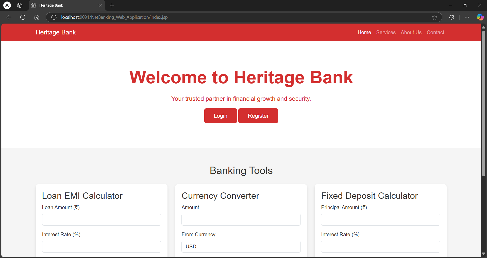
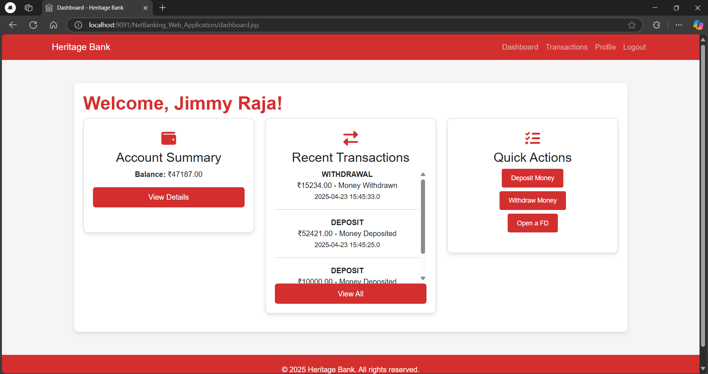
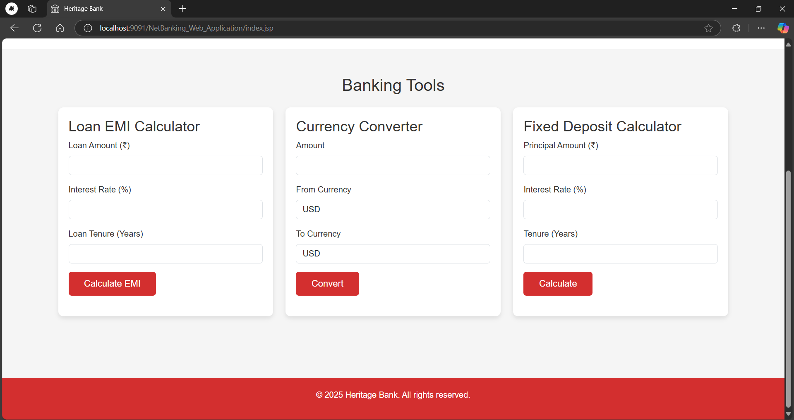
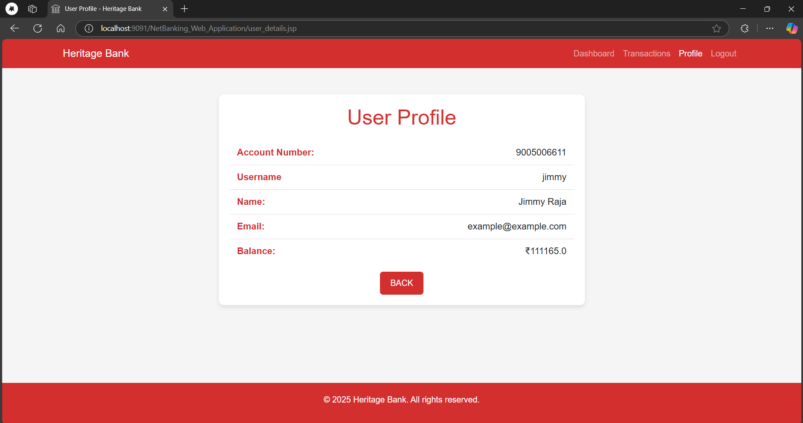
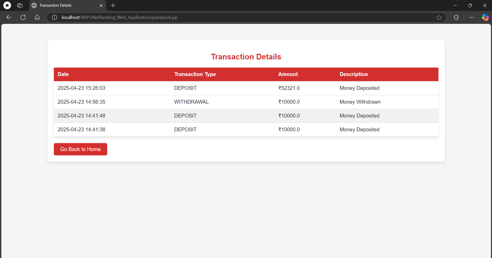

# Heritage Bank Net Banking Web Application

A comprehensive web-based banking application developed using Java EE technologies. This application provides various banking services including account management, transactions, and financial calculators.

## Project Overview

This is a dynamic web application developed using:
- Java EE
- JSP (Java Server Pages)
- Servlets
- MySQL Database
- HTML/CSS/JavaScript

## Prerequisites

Before running this application, ensure you have the following installed:

1. **Java Development Kit (JDK) 8 or later**
   - Download from [Oracle's website](https://www.oracle.com/java/technologies/javase-downloads.html)
   - Set JAVA_HOME environment variable

2. **Eclipse IDE 2020-06 for Java EE Developers**
   - Download from [Eclipse website](https://www.eclipse.org/downloads/packages/release/2020-06/r/eclipse-ide-enterprise-java-developers)

3. **Apache Tomcat 9.0**
   - Download from [Apache Tomcat website](https://tomcat.apache.org/download-90.cgi)
   - Set CATALINA_HOME environment variable

4. **MySQL Server 8.x**
   - Download from [MySQL website](https://dev.mysql.com/downloads/mysql/)
   - Create a database named `bankdb`

## Project Structure

```
HeritageBank-NetBankingWebApplication/
├── Heritage_Bank/
│   ├── src/
│   │   └── com/
│   │       └── netbanking/
│   │           ├── LoginServlet.java
│   │           ├── RegisterServlet.java
│   │           └── DBConnection.java
│   ├── WebContent/
│   │   ├── WEB-INF/
│   │   ├── META-INF/
│   │   ├── index.jsp
│   │   ├── login.jsp
│   │   ├── register.jsp
│   │   ├── dashboard.jsp
│   │   ├── user_details.jsp
│   │   ├── deposit.jsp
│   │   ├── withdraw.jsp
│   │   ├── passbook.jsp
│   │   ├── fd_registration.jsp
│   │   ├── calculateEMI.jsp
│   │   ├── calculateFD.jsp
│   │   ├── convertCurrency.jsp
│   │   ├── about.jsp
│   │   ├── contact.jsp
│   │   └── services.jsp
│   ├── build/
│   ├── .settings/
│   ├── .project
│   └── .classpath
├── README.md
└── screenshots/
```

## Database Setup

1. Create a MySQL database named `bankdb`

2. MySQL Connector/J (JDBC Driver):
   - The connector is already included in `Heritage_Bank/WebContent/WEB-INF/lib/`
   - If the connector is missing, you can reinstall it:
     - Download from [MySQL Connector/J website](https://dev.mysql.com/downloads/connector/j/)
     - Choose Platform Independent version
     - Extract the downloaded zip file
     - Copy the `mysql-connector-java-8.x.x.jar` file to `Heritage_Bank/WebContent/WEB-INF/lib/`

3. Import the database schema:
   - Open MySQL command line or MySQL Workbench
   - Execute the SQL commands from `heritage_bank.sql` file
   - This will create all necessary tables and sample data

4. Update the database connection details in `Heritage_Bank/src/com/netbanking/DBConnection.java`:
   ```java
   private static final String URL = "jdbc:mysql://localhost:3306/bankdb";
   private static final String USER = "your_username";
   private static final String PASSWORD = "your_password";
   ```

### Database Schema

The application uses the following tables:
- `users` - Stores user information including:
  - User ID (u_id)
  - Full Name
  - Email
  - Username
  - Password
  - Balance
  - Created At timestamp

- `transactions` - Records all banking transactions:
  - Transaction ID
  - User ID (u_id)
  - Type (DEPOSIT/WITHDRAWAL)
  - Amount
  - Description
  - Transaction Date

The `heritage_bank.sql` file includes:
- Complete database schema creation
- Table structures with proper constraints
- Foreign key relationships
- Sample data for testing
- Performance optimization indexes
- Transaction validation triggers


## Setup Instructions

### 1. Import Project in Eclipse

1. Open Eclipse IDE
2. Go to File → Import
3. Select "Existing Projects into Workspace"
4. Browse to the `Heritage_Bank` directory
5. Click Finish

### 2. Configure Tomcat Server

1. In Eclipse, go to Window → Preferences → Server → Runtime Environments
2. Click Add
3. Select "Apache Tomcat v9.0"
4. Browse to your Tomcat installation directory
5. Click Finish

### 3. Add Project to Server

1. In Eclipse, go to Window → Show View → Servers
2. Right-click in the Servers view
3. Select New → Server
4. Choose Apache Tomcat v9.0
5. Add the project to the server
6. Click Finish

### 4. Run the Application

1. Right-click on the project
2. Select Run As → Run on Server
3. Choose your configured Tomcat server
4. Click Finish

## Features

- User Authentication
  - Secure login system
  - Input validation
  - Error handling with user-friendly messages
- Dashboard
  - Account balance display
  - Recent transactions view
  - Quick action buttons
- Transaction Management
  - Deposit funds
  - Withdraw funds
  - Transaction history
- User Profile Management
- Financial Tools
  - EMI Calculator
  - Fixed Deposit Calculator
  - Currency Converter

## Screenshots

### Homepage

*The homepage features a clean interface with login and registration options, along with useful banking tools including Loan EMI Calculator, Currency Converter, and Fixed Deposit Calculator.*

### Dashboard

*The dashboard shows account summary, recent transactions, and quick actions for banking operations. Users can view their balance, recent activities, and access common banking functions like deposits, withdrawals, and FD creation.*

### Banking Tools

*Comprehensive financial tools including Loan EMI Calculator for loan planning, Currency Converter for foreign exchange rates, and Fixed Deposit Calculator for investment planning.*

### User Profile

*User profile management interface where customers can view and update their personal information and account settings.*

### Passbook

*Digital passbook showing detailed transaction history with timestamps, transaction types, and running balance for easy account monitoring.*

## Troubleshooting

1. **Database Connection Issues**
   - Verify MySQL service is running
   - Check database credentials in DBConnection.java
   - Ensure MySQL JDBC driver is in the classpath

2. **Tomcat Server Issues**
   - Verify Tomcat installation
   - Check port conflicts (default port 8080)
   - Ensure JAVA_HOME and CATALINA_HOME are set correctly

3. **Eclipse Configuration Issues**
   - Verify Java EE perspective is enabled
   - Check project facets configuration
   - Ensure proper server runtime environment